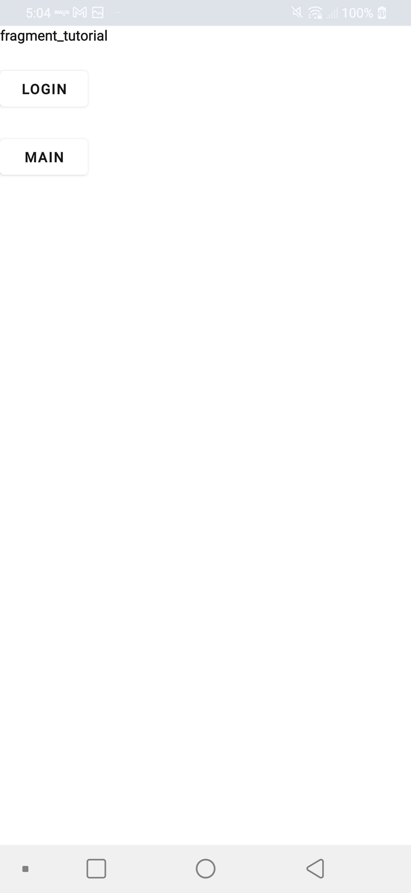
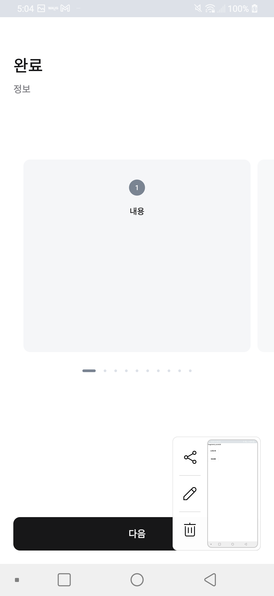
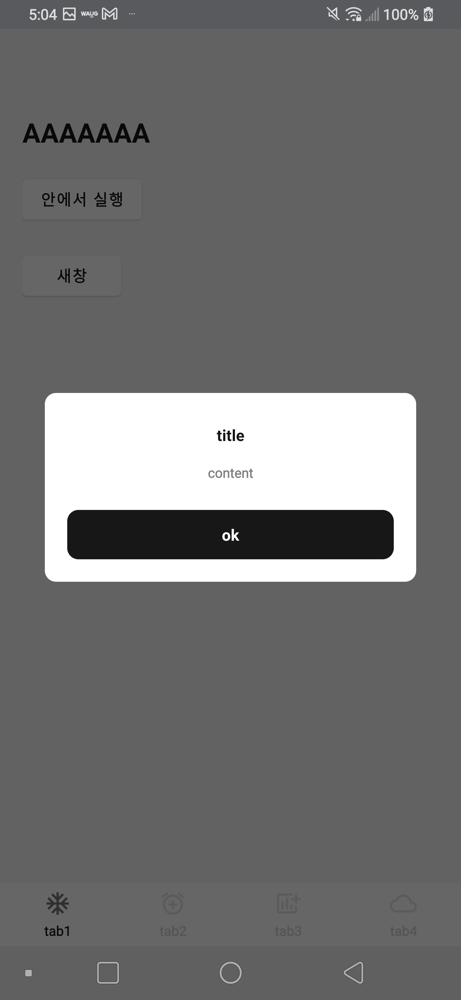
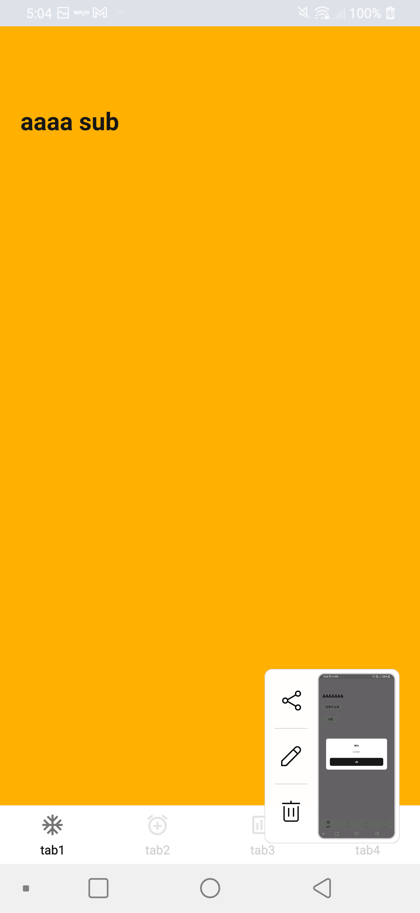

Navigation Graph Sample
====================
스플래시 네비게이션 그래프
ViewPager2 + RecyclerView.Adapter
MainFragment navigation Graph
(app/src/main/res/navigation)

Introduction
------------

Getting Started
---------------

Screenshots
-----------

Support
-------

- Stack Overflow:
  - https://developer.android.com/guide/navigation/navigation-getting-started
  - https://github.com/tommybuonomo/dotsindicator (Material View Pager Dots Indicator)

